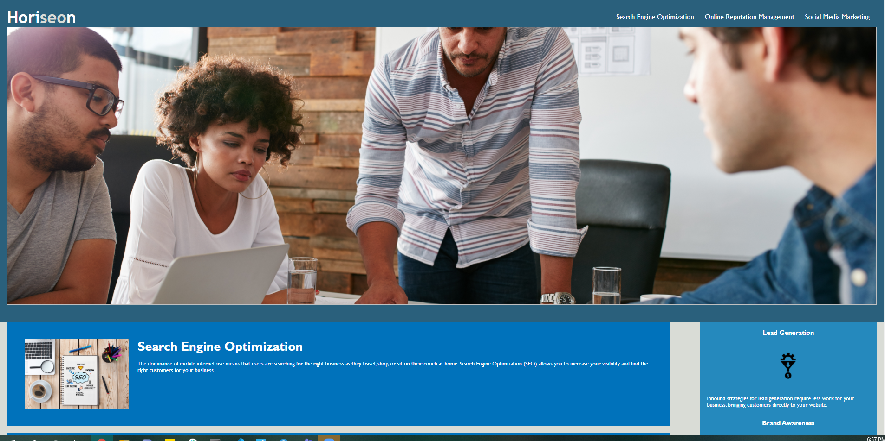

# HORISEON Digital Marketing Website Optimization
This respository contains a project 
Refactoring an existing website to improve the **accessibility**. The tech lead has given a small list of specific criterias to satisfy the project.

Below is the scope of the project:
## User Story
```
AS A marketing agency
I WANT a codebase that follows accessibility standards
SO THAT our own site is optimized for search engines
```
## Scope of Work
```
GIVEN a webpage meets accessibility standards
WHEN I view the source code
THEN I find semantic HTML elements

WHEN I view the structure of the HTML elements
THEN I find that the elements follow a logical structure independent of styling and positioning

WHEN I view the image elements
THEN I find accessible alt attributes

WHEN I view the heading attributes
THEN they fall in sequential order

WHEN I view the title element
THEN I find a concise, descriptive title
```
## Submission Link

Repository URL: [https://github.com/melissa-tan/Horison-Website_Refactoring](https://github.com/melissa-tan/Horison-Website_Refactoring)

Website URL: [https://melissa-tan.github.io/Horison-Website_Refactoring/](https://melissa-tan.github.io/Horison-Website_Refactoring/)

## Screenshot
The below image shows the website after refactoring.

